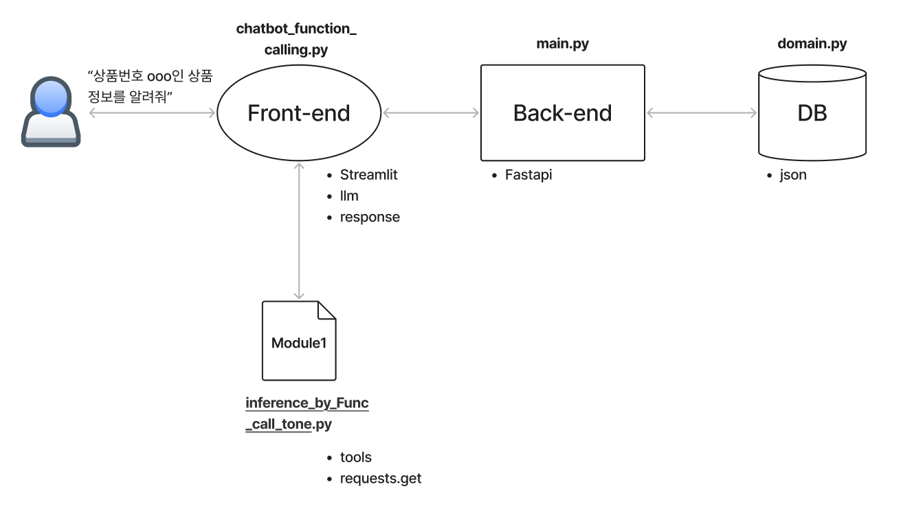

(2025.01.08 최종 수정)
https://github.com/donghwan2/shopping_help_bot

# File Descriptions

- main.py

  - FastAPI app(BE Server)
- chatbot_function_calling_tone.py

  - Streamlit(FE UI)
- inference_by_Func_call_tone.py

  - Module : chatbot이 가져다 쓰는 function tools. main 서버에 requests 날리는 함수들.
- domain.py

  - DB. 서버가 정보를 가져오는 곳.

# 실행

```
uvicorn main:app --reload
streamlit run chatbot_function_calling_tone.py
```

# Project Structure


